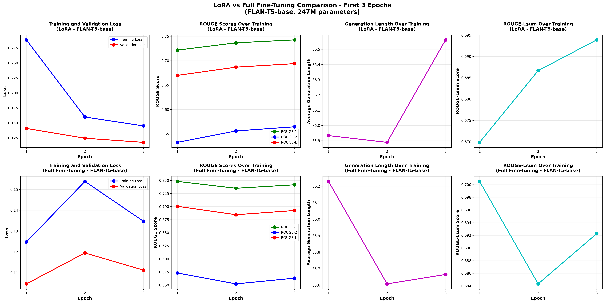

{}
This page provides a **high-level overview** only.  
For full methodology, experiments, training scripts, and results, see the **GitHub repository**.
{}

## Overview

This project focuses on **biomedical lay summarisation**, translating expert-level
radiology reports into language accessible to non-experts. The work fine-tunes
instruction-tuned **FLAN-T5** models on the **BioLaySumm 2025** dataset and
systematically evaluates different adaptation strategies.

## Methods

Three optimisation strategies are explored:

- **Full Fine-Tuning (FFT)**: updates all model parameters.
- **LoRA (PEFT)**: updates a small set of low-rank adapter weights
  (~2–3% of parameters).
- **Evolution Strategies (ES)**: gradient-free optimisation via population-based
  parameter perturbations.

Performance is evaluated using **ROUGE-1/2/L/Lsum**, with analysis of compute cost,
convergence behaviour, and parameter efficiency.

## Key Findings

- **LoRA achieves comparable or slightly higher ROUGE scores** than full fine-tuning
  while training only ~2–3% of parameters.
- **FLAN-T5-Base + LoRA** provides the best balance of quality and efficiency.
- Evolution Strategies offer fast iteration but underperform gradient-based methods
  for this task.

## Example Visuals

<!-- Replace with actual images if desired -->

## Reproducibility & Code

All experiments were run on **NVIDIA A100 GPUs** using PyTorch and Hugging Face
Transformers. Training scripts, hyperparameters, datasets, and seeds are fully
documented in the repository.

👉 **Full code and documentation:**  
https://github.com/Jevi-Waugh/BioLaySumm-Flan-T5/tree/topic-recognition/recognition/FLAN-T5-Jevi-Waugh
